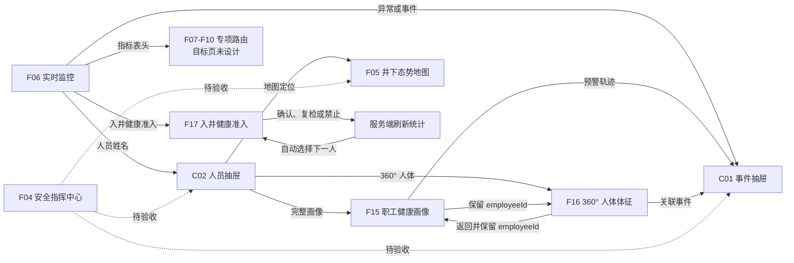
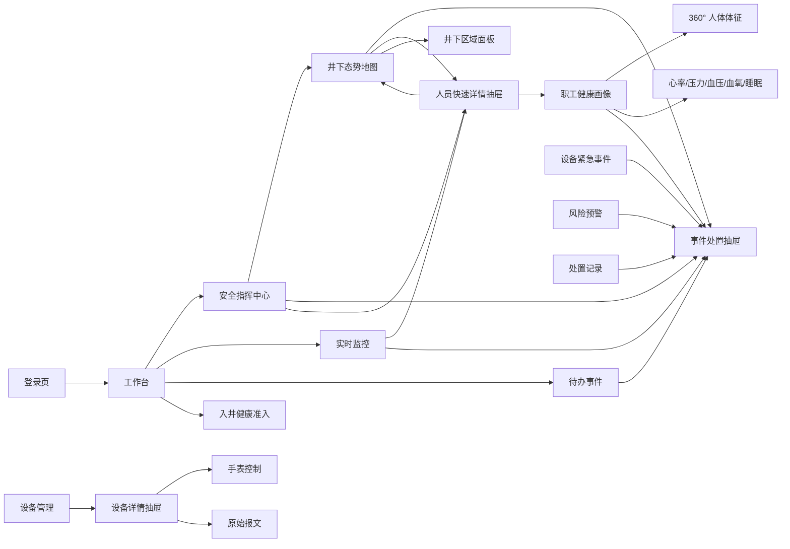
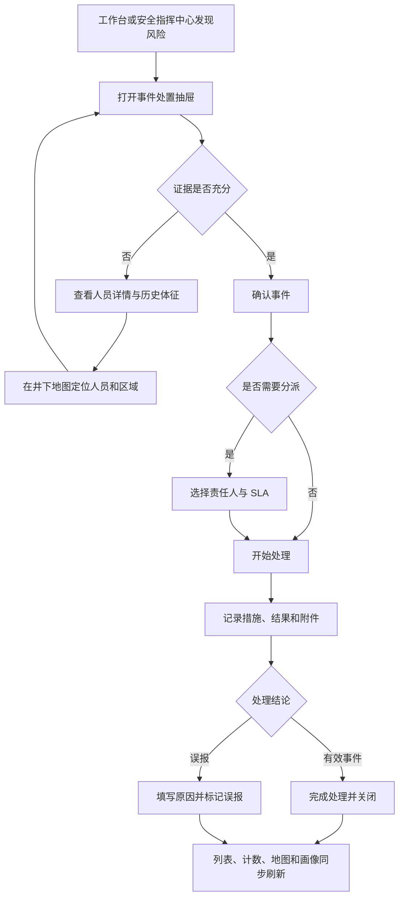
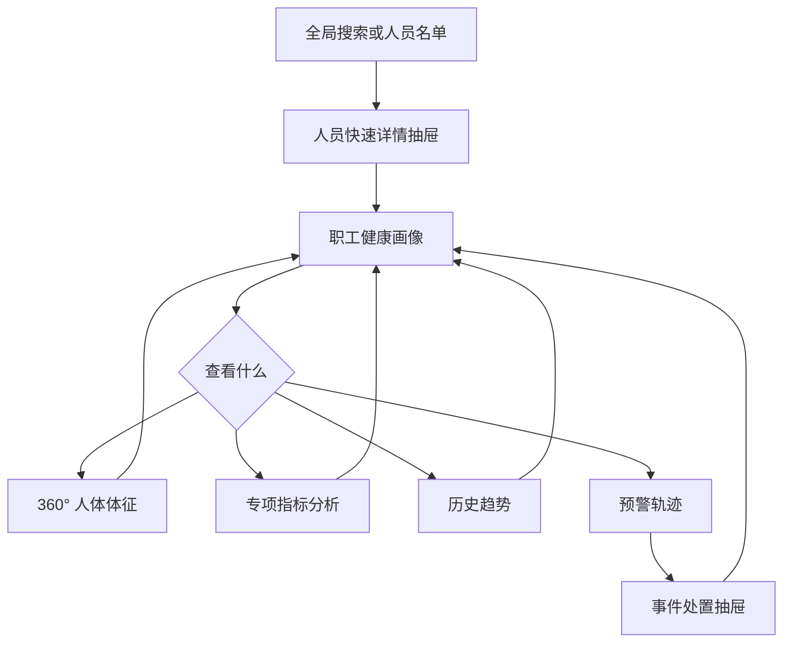
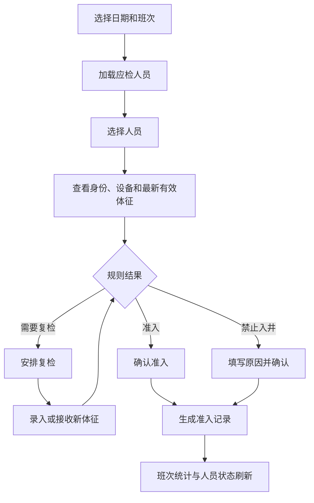

# HealthNext Figma 页面设计与交互计划

## 1. 这份计划怎么使用

这份计划只定义页面、公共交互界面和页面之间的操作逻辑，不包含数据库、后端架构或开发排期。

建议在 Figma Design 中按以下顺序执行：

1. 先使用 `F00` 创建基础视觉、应用外壳和公共组件。
2. 按 `F01-F31` 分别创建设计页面，不要一次生成全部页面。
3. 按 `C01-C05` 创建公共抽屉、面板和状态组件。
4. 将页面和公共界面连接成可点击 Prototype。
5. 每个页面至少保留 `Default`、`Loading`、`Empty`、`Error` 四个 Frame；实时页面额外增加 `Stale`，操作页面额外增加 `NoPermission`。
6. 最终交付以 Figma 中的 Auto Layout、Variables、Components、Variants 和 Prototype 为准，效果图只作参考。

## 2. 当前设计进度（截至 2026-09-09）

当前正式设计文件：[HealthNext Product Design](https://figma.com/design/bDBiJ3oavC5ZMCGIXK1gsW/HealthNext-Product-Design)。Figma Make 交互稿：[HealthNext Design System Make](https://figma.com/make/9E0ePUyQrHsx3RuzNUzrAV/HealthNext-Design-System)。

本节按 Figma 文件中的实际 Frame 统计，不把本文中的计划、提示词或旧版归档稿算作已设计。

状态口径：

| 状态 | 判定标准 |
| --- | --- |
| 已正式归档 | 页面已有正式 Frame，并放在对应产品分区中 |
| Make 可交互，待归档 | Figma Make 中已有可操作界面，但尚未整理成正式设计 Frame |
| 部分完成 | 只完成页面或组件的一部分，还不能作为完整设计交付 |
| 未设计 | 当前只有本文中的页面说明和 Figma Design 提示词 |

### 2.1 总体结论

- 业务页面共 `31` 个：`6` 个已正式归档，`1` 个在 Make 中可交互但待正式归档，`24` 个未设计。
- 已正式归档：`F04` 安全指挥中心、`F05` 井下态势地图、`F06` 实时监控、`F15` 职工健康画像、`F16` 360° 人体体征、`F17` 入井健康准入。
- Make 中已实现但待正式归档：`F02` 工作台。
- F00 只完成了 App Shell 示例；正式 `01_Foundations` 和 `02_Components` 分区仍为空，因此设计系统还没有完成交付。
- `C01` 事件处置抽屉和 `C02` 人员快速详情抽屉已经出现在 Make 的跨页交互中，但还没有作为独立组件归档到 `02_Components`。
- `F16360-Body-View` 是旧版对照稿，正式版本以 `F16_360-Body-View-V2` 为准，不能重复计数。
- `99_Archive` 中的 `F00App-Shell-And-Workbench` 是历史稿，不计入正式页面完成度。
- `90_Prototype-Flows` 仍为空。现有页面已有部分局部跳转，但五条端到端 Prototype 流程尚未正式归档和验收。

### 2.2 Figma 分区实际内容

| Figma 分区 | 当前实际内容 | 结论 |
| --- | --- | --- |
| `00Cover` | 空 | 未设计封面和交付说明 |
| `01_Foundations` | 空 | 色彩、字体、间距等 Variables 待归档 |
| `02_Components` | 空 | 公共组件及 Variants 待归档 |
| `03_App-Shell` | `HealthNext Design System` | App Shell 已有正式 Frame |
| `10_Overview` | 空 | F01-F03 均未正式归档 |
| `20_Command-Center` | `F04Safety-Command-Center`、`F05Underground-GIS`、`F05Map-Context-Variant` | F04、F05 已归档 |
| `30_Health-Monitor` | `F06_Real-Time-Monitor`、`F17_Mine-Entry-Health-Admission` | F06、F17 已归档 |
| `40_Employee-Health` | `F15_Employee-Health-Profile`、`F16_360-Body-View-V2`、旧版 `F16360-Body-View`、`Shell` | F15、F16 已归档，旧版只作对照 |
| `50_Incident-Management` | 空 | F18-F21 未设计 |
| `60_Device-And-Data` | 空 | F22-F24 未设计 |
| `70_Report-And-AI` | 空 | F25-F26 未设计 |
| `80_System-Management` | 空 | F27-F31 未设计 |
| `90_Prototype-Flows` | 空 | 端到端原型流程待建立 |
| `99_Archive` | `F00App-Shell-And-Workbench` | 历史稿，不计完成度 |

### 2.3 F01-F31 逐页状态

| 编号 | 页面 | 当前状态 | 下一项设计工作 |
| --- | --- | --- | --- |
| F01 | 登录页 | 未设计 | 建立桌面、移动端及登录失败状态 |
| F02 | 工作台 | Make 可交互，待归档 | 整理到 `10_Overview`，补齐四种数据状态 |
| F03 | 健康监测总览 | 未设计 | 完成总览、指标和部门下钻稿 |
| F04 | 安全指挥中心 | 已正式归档 | 补齐状态 Frame，并验收 Prototype 热区 |
| F05 | 井下态势地图 | 已正式归档 | 验收图层、搜索、标记、区域和轨迹交互 |
| F06 | 实时监控 | 已正式归档 | 已完成主要交互点验，补正式标注和组件引用 |
| F07 | 心率分析 | 未设计 | 建立专项分析模板的第一个标准页面 |
| F08 | 压力分析 | 未设计 | 复用专项分析模板，补压力特有口径 |
| F09 | 血压分析 | 未设计 | 复用专项分析模板，设计双指标趋势 |
| F10 | 血氧分析 | 未设计 | 区分有效数据、无效数据和未佩戴状态 |
| F11 | 睡眠分析 | 未设计 | 设计上传覆盖、结构和人员明细 |
| F12 | 趋势预警 | 未设计 | 设计风险队列、原始证据和规则说明 |
| F13 | 风险预警 | 未设计 | 设计三类事件来源的统一查询页 |
| F14 | 职工档案 | 未设计 | 设计人员表格、编辑和导入流程 |
| F15 | 职工健康画像 | 已正式归档 | 补齐状态稿并验收所有下钻入口 |
| F16 | 360° 人体体征 | 已正式归档 | 以 V2 为正式稿，补降级和无数据状态 |
| F17 | 入井健康准入 | 已正式归档 | 主要状态和连续处理流程已点验 |
| F18 | 待办事件 | 未设计 | 优先设计，作为事件处置主入口 |
| F19 | 设备紧急事件 | 未设计 | 设计 SOS 与其他设备报警的分类界面 |
| F20 | 风险规则配置 | 未设计 | 设计草稿、校验、发布和版本历史 |
| F21 | 处置记录 | 未设计 | 设计只读审计、筛选和导出状态 |
| F22 | 设备管理 | 未设计 | 设计设备列表、绑定、导入和停用流程 |
| F23 | 手表控制 | 未设计 | 设计命令确认、回传、超时和禁用状态 |
| F24 | 手表原始报文 | 未设计 | 设计实时日志、暂停和解析详情 |
| F25 | 报告中心 | 未设计 | 设计任务、预览、生成和失败重试 |
| F26 | AI 健康助手 | 未设计 | 设计受控查询、引用和报告转交 |
| F27 | 用户管理 | 未设计 | 设计账号维护和危险操作确认 |
| F28 | 角色管理 | 未设计 | 设计权限树、数据范围和变更摘要 |
| F29 | 部门管理 | 未设计 | 设计组织树、移动和影响确认 |
| F30 | 工种管理 | 未设计 | 设计工种、风险分类和规则关联 |
| F31 | 系统设置 | 未设计 | 设计设置分类、连接测试和保存状态 |

### 2.4 C01-C05 公共交互界面状态

| 编号 | 公共界面 | 当前状态 | 下一项设计工作 |
| --- | --- | --- | --- |
| C01 | 事件处置抽屉 | 部分完成 | Make 中已有跨页使用；需归档独立 Component 和 8 个生命周期 Variant |
| C02 | 人员快速详情抽屉 | 部分完成 | Make 中已有跨页使用；需归档独立 Component 和设备/数据状态 Variant |
| C03 | 设备详情抽屉 | 未设计 | 与 F22-F24 一起完成 |
| C04 | 井下区域面板 | 未设计 | 与 F05 Prototype 补齐时完成 |
| C05 | 全局数据与页面状态 | 未设计 | 先建立公共状态组件，再补到所有页面 |

### 2.5 当前已经连通的交互

实线表示已经在当前交互稿中点验；虚线表示两端页面已经设计，但 Prototype 连接仍需正式验收。指向“未设计目标页”的路由只证明入口存在，不代表目标页面已经设计完成。



已点验的具体行为：

| 页面 | 已确认交互 | 尚需补验 |
| --- | --- | --- |
| F06 实时监控 | 指标表头路由、人员抽屉、事件抽屉、服务端分页、Default/CachedData/NoOnlineUsers/Loading、30 秒自动刷新、进入 F17 | 专项目标页完成后的往返上下文恢复 |
| F17 入井健康准入 | 日期/班次/部门/状态筛选、人员队列、六种状态、建议和规则证据、人工覆盖原因与二次确认、完成后刷新统计并自动选择下一人 | 与工作台、人员抽屉的完整往返流程 |
| F15/F16 人员健康链路 | 人员抽屉进入画像或人体页、F15 与 F16 双向切换并保留 `employeeId`、人体旋转/缩放/热点、关联事件、联系处置约束 | WebGL 降级、无数据、离线和减少动态状态 |
| F04/F05 指挥地图链路 | 两个正式页面 Frame 和 F05 上下文 Variant 已存在 | 地图标记、事件、人员、区域、搜索、图层和轨迹的 Prototype 全量验收 |

### 2.6 下一步补齐顺序

1. 先完成 F00：把色彩、字体、间距 Variables 和公共 Components/Variants 正式归档；把 C01、C02 从 Make 整理进 `02_Components`。
2. 完成核心闭环：设计 F18 待办事件，补齐 C01 全生命周期，让“发现风险 -> 处置 -> 关闭 -> 列表刷新”可以完整演示。
3. 固化总览入口：把 F02 从 Make 归档，设计 F01 和 F03，连接登录、工作台、指挥中心、实时监控、待办事件和入井准入。
4. 完成人员健康域：设计 F07-F14，让 F06、F15、F16 的现有入口都落到真实目标页。
5. 完成设备与地图辅助界面：设计 C03、C04 和 F19、F22-F24，补齐定位、设备排障和控制流程。
6. 完成配置、审计与智能：设计 F20、F21、F25-F31 和 C05。
7. 最后在 `90_Prototype-Flows` 归档本文件第 17 节定义的五条端到端流程，并逐条验收返回、筛选保留、URL 上下文和状态刷新。

## 3. Figma 文件结构

```text
00_Cover
01_Foundations
02_Components
03_App-Shell
10_Overview
20_Command-Center
30_Health-Monitor
40_Employee-Health
50_Incident-Management
60_Device-And-Data
70_Report-And-AI
80_System-Management
90_Prototype-Flows
99_Archive
```

正式工作页面默认建立以下 Frame：

| Frame | 尺寸 | 用途 |
| --- | ---: | --- |
| Desktop | 1440 × 900 | 日常设计和开发基准 |
| Wide | 1920 × 1080 | 指挥大屏、地图、人体 3D |
| Narrow | 1024 × 768 | 小型办公显示器 |
| Mobile | 390 × 844 | 查询、查看、确认等轻量操作 |

安全指挥中心、井下态势地图和 360° 人体页不需要把完整桌面能力压缩到手机。移动端为这些页面设计摘要模式，并提供“建议在大屏查看”的明确提示。

## 4. F00：先让 Figma 建立统一设计系统

将下面整段提示词交给 Figma Design：

```text
创建一个名为 HealthNext 的矿山职业健康与安全管理平台设计系统，并创建可复用的桌面应用外壳。产品用户是值班调度员、安全管理人员、职业健康管理人员和系统管理员。

设计目标：专业、克制、精密、适合长时间工作；重要的指挥和三维页面具有沉浸感。不要做营销网站、游戏大厅或夸张的赛博朋克界面。

使用深色工业主题：页面背景 #071018，一级表面 #0B151F，二级表面 #101D28，边界 #263946，主文字 #EAF2F5，次文字 #91A5AD。青色 #36C5D8 只表示实时信号和当前交互，绿色 #35C58A 表示正常，琥珀色 #E9AE52 表示关注，红色 #EF6262 只表示危急，蓝色 #5A8DEE 表示普通信息。禁止大面积紫色、蓝紫渐变、装饰光球、玻璃卡片堆叠和发光描边泛滥。

创建 Variables：颜色、4/8/12/16/24/32 间距、4/6/8 圆角、字号、边框和层级。中文字使用 PingFang SC，数字开启 tabular numbers。正文不得小于 12px，表格正文 13px，页面标题 20-24px。不要使用负字距。

创建 216px 展开和 64px 收起两种 Sidebar，56px Topbar。侧边栏一级导航包括：总览、安全指挥、健康监测、人员健康、预警处置、设备与数据、报告与智能、系统管理。Topbar 包含折叠按钮、面包屑、全局人员搜索、实时连接状态、通知入口和用户菜单。

用 Auto Layout 创建这些 Components 和 Variants：Sidebar、Topbar、PageHeader、FilterBar、Button、IconButton、Input、Select、DateRange、Tabs、StatusTag、MetricTile、DataTable、Pagination、EmptyState、ErrorState、StaleState、PersonSummary、VitalReading、ChartFrame、MapToolbar、MapLegend、Timeline、Drawer、Dialog、Skeleton。控件状态包括 Default、Hover、Active、Disabled、Loading、Error；数据状态包括 Normal、Attention、Warning、Critical、Offline、Stale、NoData。

卡片圆角不超过 6px，避免卡片嵌套。表格、筛选和分页强调效率；图表必须预留标题、单位、样本数、更新时间、图例和空态位置。使用专业线性图标，不使用表情符号或手绘图标。创建 Desktop 1440、Wide 1920 和 Narrow 1024 的应用外壳示例。
```

## 5. 页面导航全景图



## 6. 全局交互规则

### 6.1 导航与返回

- 一级导航切换产品域，二级菜单进入具体页面。
- 面包屑只表示页面层级，不重复展示侧边栏菜单。
- 从列表进入专门页面时，保留原页面筛选条件、页码和滚动位置；返回后恢复现场。
- 从一个对象跳转到另一个页面时必须携带对象上下文。例如从人员抽屉进入画像时保留 `employeeId`，从事件进入地图时保留 `incidentId` 和地图位置。
- 浏览器后退必须可用。抽屉和选中对象与 URL 状态同步，使刷新和分享链接后仍能恢复选中内容。

### 6.2 抽屉、弹窗和专门页面

- 快速查看使用右侧抽屉；长时间分析或复杂操作进入专门页面。
- 点击人员姓名、头像或人员地图标记统一打开人员快速详情抽屉。
- 点击风险事件统一打开事件处置抽屉。
- 点击设备 IMEI 或设备名称统一打开设备详情抽屉。
- 同一时间最多打开一个主抽屉。需要从人员切换到事件时，在同一个抽屉区域替换内容，并保留返回人员详情的入口。
- 简单确认使用弹窗；编辑复杂表单使用抽屉；全屏地图和三维场景使用独立页面。

### 6.3 筛选与下钻

- 页面顶部筛选只影响当前页面。全局人员搜索可以从任何页面打开人员抽屉。
- 点击统计数字或图表数据点后，进入对应明细时自动带入筛选条件，并在目标页显示“来自某某页面”的可关闭条件标签。
- 日期、部门、工种、状态等条件必须在跳转后可见，不能暗中生效。
- 清除下钻条件后留在当前页面，不自动返回来源页。

### 6.4 状态更新

- 确认、分派、处理、关闭、误报、设备绑定和规则发布成功后，重新读取服务端状态。
- 状态更新后同步刷新当前抽屉、来源列表、顶部计数和相关地图标记。
- 刷新失败时保留最后一次成功数据，显示数据时间和“正在查看缓存数据”。
- 不用前端动画或成功提示代替真实操作结果。

### 6.5 危险操作

- 停用用户、停用设备、发布规则、解除设备绑定和关闭事件需要确认。
- 确认弹窗说明操作对象、影响范围和不可逆部分。
- 外部呼叫、广播或设备控制显示“下发中、已确认、失败、未配置”真实状态。

## 7. 三条核心业务流程

### 7.1 风险发现与处置



### 7.2 人员健康分析



### 7.3 入井健康准入



## 8. 总览页面

### F01 登录页 `/login`

目的：完成身份验证，确认后端服务可用。

交互逻辑：登录成功进入工作台；原本由受保护页面跳转而来时，登录成功返回原页面。服务不可用时保留输入内容并显示重试。用户菜单退出后返回登录页并清除已打开的敏感页面状态。

Figma Design 提示词：

```text
在 HealthNext 设计系统中创建登录页，Desktop 1440×900 和 Mobile 390×844。使用真实矿井调度或井下作业照片作为全屏背景，降低对比度以保证文字清晰；左上显示 HealthNext 和“矿山职业健康与安全管理平台”。右侧设置约 380px 宽的登录区域，包含用户名、密码、显示密码、保持登录、登录按钮和后端服务状态。不要注册、社交登录和营销功能介绍。创建 Default、Submitting、WrongPassword、ServiceUnavailable 四种状态。登录成功的 Prototype 连接到工作台。
```

### F02 工作台 `/home`

目的：告诉当前用户今天最需要处理什么。

交互逻辑：点击“我的待办”进入待办事件并带入当前用户；点击高危数字进入高危事件筛选；点击准入复核进入入井准入；点击离线设备进入设备管理。待办行直接打开事件抽屉，人员姓名打开人员抽屉。

Figma Design 提示词：

```text
创建 HealthNext 个人工作台 Desktop 1440×900。保持现有 Sidebar 和 Topbar。页面顶部显示当前班次、矿区、数据更新时间和手动刷新。首行用四个紧凑 MetricTile 展示“我的待办、今日高危、待复检准入、离线设备”，每项可点击下钻。主体左侧为按严重度和 SLA 排序的待办时间线，中间为今日健康态势和七日趋势，右侧为常用入口、实时连接与外部系统状态。人员姓名可点击，事件行可点击。设计 Default、NoTodo、CachedData、Loading 四个状态；不要做成领导驾驶舱，不要使用大面积装饰图。
```

### F03 健康监测总览 `/health-monitor/dashboard`

目的：分析全矿健康覆盖、异常结构和变化趋势。

交互逻辑：点击异常人数进入实时监控并带入 `warning`；点击某项指标进入对应专项分析；点击部门柱形进入专项页并带入部门；重点人员打开人员抽屉。

Figma Design 提示词：

```text
创建健康监测总览 Desktop 1440×900。顶部 FilterBar 包含日期范围、部门、工种和班次。第一行显示在册人数、当前在线、体征覆盖、当前异常，其中异常主值使用“异常人数 / 覆盖人数”。主体展示各指标覆盖与异常分布、部门风险排名、七日异常趋势、设备采集质量和重点人员表格。所有图表包含单位、样本数、更新时间和图例。让指标名称、部门柱形和人员姓名看起来可点击。创建完整数据、业务空数据、部分指标缺失、请求失败但保留缓存四种状态。
```

## 9. 安全指挥页面

### F04 安全指挥中心 `/safety-command/index`

目的：在一屏内发现、定位并进入高优先级事件处置。

交互逻辑：事件流和地图标记打开事件抽屉；风险人员打开人员抽屉；地图区域点击打开区域面板；“进入地图”保留当前事件或区域上下文。周期切换重新加载所有摘要。

Figma Design 提示词：

```text
创建 Wide 1920×1080 和 Desktop 1440×900 的安全指挥中心。使用沉浸式深色布局，但保留清楚的信息层级。顶部紧凑展示矿区、班次、日/周/月周期、实时连接、更新时间和全屏按钮。中央以井下态势小地图为最大区域；左侧展示预警总数、高危待办、待办总数、未分派、超时和重点风险人员；右侧是按严重度和 SLA 排序的实时事件流；底部展示部门风险、设备覆盖和处置时效趋势。事件行和地图事件标记连接到事件处置抽屉，人员连接到人员抽屉，区域连接到区域面板。红色仅用于危急，不提供脱离具体事件的批量呼叫。创建 Normal、NoIncident、RealtimeDisconnected、CachedData 四种状态。
```

### F05 井下态势地图 `/mine/map`

目的：在真实巷道坐标中查看区域、人员、设备、事件和历史轨迹。

交互逻辑：图层开关控制显示；搜索结果定位并缩放；人员标记打开人员抽屉；事件标记打开事件抽屉；区域点击打开区域面板；时间轴进入轨迹回放；从其他页面带入对象时自动定位并显示来源标签。

Figma Design 提示词：

```text
创建全屏井下态势 GIS 页面，Wide 1920×1080、Desktop 1440×900 和 Mobile 摘要版。中央地图占据主要空间，展示真实复杂的 CAD/Shapefile 巷道线网、井筒、水平、工作面和中文注记，使用工程坐标，不叠加城市道路。左侧可收起图层树包含巷道、注记、区域、人员、设备、预警和 SOS；右侧只显示当前选中人员、事件或区域的单个详情面板；右上是搜索、适应窗口、测距、图层、二维/轻量三维、放大缩小和全屏图标按钮；底部显示坐标、比例尺、地图版本和轨迹时间轴。标记状态包括正常人员、离线设备、普通预警和 SOS。设计搜索定位、选中事件、区域详情、轨迹回放、地图加载失败五个 Frame，所有浮层不得遮挡主要地图。
```

## 10. 健康监测页面

### F06 实时监控 `/health-monitor/real-time`

目的：服务端分页查看当前在线人员及每项体征的新鲜度和异常原因。

交互逻辑：人员行打开人员抽屉；异常原因打开事件抽屉；指标列标题进入专项页；地图定位进入井下地图。筛选和分页由页面顶部统一控制。

Figma Design 提示词：

```text
创建高密度实时健康监控页 Desktop 1440×900。页面顶部显示在线窗口 15 分钟、体征新鲜度 5 分钟、自动刷新倒计时、状态、指标、部门和人员搜索。摘要展示在线人数、当前异常、数据陈旧和无数据人数。主体使用服务端分页表格，列出人员、部门、设备、在线状态、心率、血压、血氧、体温或压力、每项采集时间、总体状态和预警原因。用稳定图标与文字区分 normal、warning、stale、no_data，不能只靠颜色。右侧允许展开紧凑事件栏。创建正常、仅看异常、缓存数据、无在线人员、加载状态。人员和异常原因需要明显可点击。
```

### F07 心率分析 `/health-monitor/heart-rate`

目的：查看心率覆盖、异常记录、部门差异和具体人员。

交互逻辑：趋势点打开该时间点明细；部门柱形筛选人员列表；异常人员打开人员抽屉；“当前异常”从快照口径进入实时异常名单。

Figma Design 提示词：

```text
创建心率专项分析页。顶部包含日期、部门、工种和“当前异常”快捷筛选。摘要显示覆盖人数、异常人数、最低值、最高值和样本数。主体上方是带正常区间的心率时间趋势；下方左侧是各部门偏低与偏高记录数的分组柱形图，纵轴单位为“条”；右侧是服务端分页异常人员表，显示最近值、采集时间、异常方向和事件状态。图表注明阈值来源和数据更新时间。设计默认、当前异常下钻、部门下钻、无异常四个 Frame。
```

### F08 压力分析 `/health-monitor/pressure`

目的：识别持续高压力记录和需关注人员。

交互逻辑：压力等级分布筛选明细；部门数据点进入该部门名单；人员打开人员抽屉；历史趋势进入人员画像并保留指标上下文。

Figma Design 提示词：

```text
创建压力指数专项分析页，沿用 HealthNext 专项分析模板。顶部为日期、部门、工种和压力等级筛选。摘要显示覆盖人数、高压力人数、连续高压力人数和样本数。主体包括压力等级分布、时间趋势、部门高压力记录排名和重点人员分页表格。人员表显示最近压力等级、采集时间、连续次数和当前事件状态。明确这是设备压力指标，不生成情绪标签或医学诊断。创建 Default、DepartmentDrilldown、NoData、CachedData 状态。
```

### F09 血压分析 `/health-monitor/blood-pressure`

目的：联合分析收缩压和舒张压，定位连续异常人员。

交互逻辑：趋势点查看记录；异常分类筛选表格；人员打开人员抽屉；事件状态打开事件抽屉。

Figma Design 提示词：

```text
创建血压专项分析页。摘要显示覆盖人数、异常人数、收缩压极值、舒张压极值和样本数。主趋势图同时展示收缩压和舒张压以及正常范围，不使用误导性的双轴。部门图分别统计偏高与偏低记录。异常人员表显示最近读数、mmHg 单位、测量时间、连续异常次数、事件状态和查看画像操作。设计默认、连续异常筛选、无异常、部分读数状态；单次异常不得写成疾病诊断。
```

### F10 血氧分析 `/health-monitor/blood-oxygen`

目的：查看有效血氧覆盖和低血氧人员，同时区分未佩戴/无效数据。

交互逻辑：低血氧统计进入异常名单；无效数据统计进入设备数据质量明细；人员打开人员抽屉；设备进入设备抽屉。

Figma Design 提示词：

```text
创建血氧专项分析页。摘要显示有效覆盖人数、低血氧人数、最低有效值、无效或未佩戴读数。主体包含有效血氧趋势、阈值分布、部门低血氧记录和异常人员分页表格。表格显示人员、设备、最近有效值、采集时间、无效原因和事件状态。无效读数使用 NoData 语义，不显示为正常；明确百分比单位。创建正常、低血氧下钻、无效数据下钻、完全无有效样本四个 Frame。
```

### F11 睡眠分析 `/health-monitor/sleep`

目的：查看昨夜睡眠数据覆盖、时长结构和需关注人员。

交互逻辑：时长分布筛选明细；部门上传率进入部门名单；人员打开人员抽屉；日期切换刷新整页。

Figma Design 提示词：

```text
创建睡眠分析页。顶部选择日期、部门和班次。摘要显示昨夜上传覆盖、平均睡眠时长、达标人数和需关注人数。主体展示睡眠时长分布、深睡浅睡结构、七日趋势、部门上传情况和人员明细。所有统计注明覆盖人数和数据日期。创建有数据、部分上传、没有收到睡眠数据、缓存数据四个状态；不要生成虚假的睡眠评分或医学判断。
```

### F12 趋势预警 `/health-monitor/trend-warning`

目的：展示基于连续变化产生的趋势风险及其证据。

交互逻辑：趋势风险行选中后右侧更新证据图；人员打开人员抽屉；关联事件打开事件抽屉；切换指标和预测窗口重新查询。

Figma Design 提示词：

```text
创建趋势预警页，明确区分趋势风险和当前阈值越界。顶部提供指标、趋势窗口、部门、风险等级和状态筛选。左侧为趋势风险队列，显示人员、方向、连续变化天数、证据强度、当前是否越界和事件状态；右侧展示选中人员的原始时间序列、阈值线、趋势区间、样本数和规则说明；底部显示生成与处置审计。创建选中风险、无趋势风险、样本不足、规则停用状态。文案保持概率和证据语气，不制造确定性医学判断。
```

### F13 风险预警 `/health-monitor/risk-warning`

目的：统一查询不同来源的风险事件。

交互逻辑：统计项改变列表筛选；事件行打开事件抽屉；人员打开人员抽屉；来源标签进入相应专项页或设备页。

Figma Design 提示词：

```text
创建风险预警查询页。将 HEALTH_THRESHOLD、DEVICE_ALARM、TREND_WARNING 三种来源用清楚的中文标签区分，严重度作为独立维度。顶部筛选来源、事件代码、严重度、生命周期状态、部门和时间。摘要按来源与状态聚合，主体为可排序服务端分页表格，显示事件、人员、位置、发生时间、来源、严重度、责任人、SLA 和状态。事件行连接事件抽屉，人员连接人员抽屉。SOS 只允许出现在设备主动报警。创建默认、高危筛选、无结果和加载失败状态。
```

## 11. 人员健康页面

### F14 职工档案 `/health-monitor/employee-archive`

目的：维护和查询人员主档案及设备绑定概况。

交互逻辑：人员行打开人员抽屉；查看画像进入健康画像；地图定位进入井下地图；编辑打开档案编辑抽屉；导入打开分步校验流程。

Figma Design 提示词：

```text
创建职工档案列表页。顶部提供姓名、工号、手机号、IMEI 搜索，以及部门、工种、在职状态、设备绑定状态筛选。主体使用高密度表格，显示人员身份、部门、工种、脱敏联系方式、设备绑定、最近在线、健康数据更新时间和当前风险。行操作包括查看画像、地图定位和编辑。设计新增/编辑人员抽屉、批量导入入口、导入校验结果、空档案和无权限状态。不要使用人物卡片瀑布流。
```

### F15 职工健康画像 `/health-monitor/employee-profile`

目的：展示单个人员的身份、当前健康、历史趋势、活动和权威预警轨迹。

交互逻辑：顶部切换人员后所有模块同步刷新；体征卡进入相应专项分析；360° 按钮进入人体页；预警轨迹打开事件抽屉；地图定位进入井下地图；联系处置使用人员抽屉的联系模式。

Figma Design 提示词：

```text
创建职工健康画像 Desktop 1440×900。顶部提供人员搜索、上一人/下一人、手动刷新、自动刷新倒计时。身份摘要显示姓名、工号、部门、工种、设备和当前位置。主体左侧展示当前体征，每个指标独立显示数值、单位、采集时间、新鲜度与状态；中部展示七日趋势和今日活动；右侧展示设备状态、联系处置、地图定位和近 30 日预警轨迹。历史区域提供日期范围和查询按钮，并显示样本数与聚合粒度。提供醒目的“360° 人体体征”入口。创建正常、人员无设备、体征陈旧、无历史、刷新失败但保留数据五个 Frame。
```

### F16 360° 人体体征 `/health-monitor/body-360`

目的：以高表现力的三维人体呈现真实体征与异常位置入口。

交互逻辑：拖动旋转、滚轮缩放、重置视角；点击热点更新右侧指标详情；人员切换刷新体征和事件；事件条目打开事件抽屉；返回画像保留人员。自动旋转和减少动态可以独立开关。

Figma Design 提示词：

```text
创建 HealthNext 标志性的 360° 人体体征页面，Wide 1920×1080 和 Desktop 1440×900。中央是可拖拽旋转、缩放的真实全身 GLB 线框人体，使用克制的青绿色扫描材质、局部扫描线和少量粒子，场景全幅展开，不放在装饰卡片中。人体热点对应心率、血氧、体温、压力和血压，热点颜色来自真实状态。左上提供人员搜索、身份和返回健康画像；右侧紧凑展示当前选中指标的数值、单位、采集时间、阈值、最近趋势和相关事件；底部使用图标按钮提供自动旋转、重置视角、减少动态和全屏。设计正常人体、选中异常热点、模型加载、WebGL 不可用、低性能降级、人员无数据六个 Frame。不要绘制虚构器官热区或伪造 ECG。
```

### F17 入井健康准入 `/health-monitor/mine-entry`

目的：根据当前班次、有效体征和规则完成准入、复检或禁止入井。

交互逻辑：选择班次加载队列；选择人员更新右侧证据；复检后重新评估；人工确认必须填写原因；完成后选择下一人并刷新统计。人员姓名可打开人员抽屉。

Figma Design 提示词：

```text
创建班前入井健康准入页。顶部选择日期、班次、部门和准入状态，摘要显示应检、已检、准入、待复检、禁止入井。主体左侧是人员检查队列与进度，右侧是选中人员的身份、设备、最新有效体征、每项采集时间、规则命中、复检记录和建议结论。固定操作区包含确认准入、安排复检、禁止入井；人工覆盖建议时必须填写原因。设计待检查、建议准入、需要复检、禁止入井、体征无效、已完成六个状态，并建立连续处理下一人的 Prototype。
```

## 12. 预警处置页面

### F18 待办事件 `/alert-management/notifications`

目的：处理当前仍需行动的事件。

交互逻辑：摘要数字改变筛选；事件行打开事件抽屉；确认和分派可在行内完成，复杂操作进入抽屉；处理成功后保留当前筛选并刷新列表。

Figma Design 提示词：

```text
创建值班人员待办事件页。顶部筛选严重度、来源、分派状态、SLA、部门和时间；摘要显示我的待办、高危未确认、未分派和已超时。主体为高密度分页表格，状态严格区分新建、已确认、已分派、处理中。行内只保留查看、确认和分派三项高频动作，其他操作进入事件处置抽屉。显示人员、位置、证据摘要、责任人、剩余 SLA 和更新时间。创建默认、我的待办、高危超时、无待办和处理后刷新状态；不要设计“已读”。
```

### F19 设备紧急事件 `/alert-management/sos`

目的：专门处理手表主动上报的 SOS、跌倒、拆卸、低电等设备事件。

交互逻辑：事件列表选中后更新右侧详情；事件打开事件抽屉；人员打开人员抽屉；位置进入地图；设备打开设备抽屉。

Figma Design 提示词：

```text
创建设备紧急事件页。顶部展示未处理设备报警、真正 SOS、跌倒事件和离线关联设备数量，并提供事件代码、严重度、状态、部门和时间筛选。主体左侧为按严重度与时间排序的事件列表，右侧展示选中事件的人员、设备、井下位置、最近通讯、证据和处置时间线。提供打开事件处置、人员详情、设备详情和地图定位。SOS、跌倒、拆卸、低电使用不同代码和图标，严重度单独显示。创建真实 SOS、普通设备报警、未绑定设备、无事件状态；不得混入健康阈值事件。
```

### F20 风险规则配置 `/alert-management/config`

目的：配置、验证、发布并追踪风险规则版本。

交互逻辑：左侧选规则，右侧编辑；保存草稿不生效，发布后才生效；发布前展示变更和影响；版本历史可以查看和回滚。未接入策略不可启用。

Figma Design 提示词：

```text
创建风险规则配置页。左侧按健康阈值、设备报警、趋势规则分组并显示启用状态；右侧使用 Basic、Conditions、SeverityAndSLA、Notification、VersionHistory 页签。健康规则包含指标、适用人群、上下限、持续时间、严重度和 SLA；设备报警没有数值阈值，只设置启用、严重度、SLA 与通知；未接入策略明确标记“未接入”并禁用。顶部提供保存草稿、校验和发布，发布确认展示字段变化与影响范围。设计编辑草稿、校验错误、发布确认、已发布和历史版本状态。
```

### F21 处置记录 `/alert-management/records`

目的：查询已处理、已关闭和误报事件的完整审计。

交互逻辑：事件行以只读模式打开事件抽屉；处理人进入用户详情；人员打开人员抽屉；导出使用当前筛选并显示任务进度。

Figma Design 提示词：

```text
创建处置记录审计页。顶部筛选事件来源、代码、严重度、处理结论、处理人、部门和时间。主体表格显示事件、人员、发生时间、确认时间、分派时间、处理时间、关闭时间、SLA 是否超时、处理人和结论。详情使用只读事件抽屉，时间线展示每次状态变化、备注、附件和外部动作真实结果。设计默认、误报筛选、超时筛选、导出中、无记录状态；外部系统未配置时显示 NOT_CONFIGURED。
```

## 13. 设备与数据页面

### F22 设备管理 `/admin/device-list`

目的：管理设备身份、绑定、在线状态和维护信息。

交互逻辑：设备行打开设备抽屉；人员打开人员抽屉；绑定/解绑使用确认流程；控制和原始报文进入对应页面并保留设备；导入先校验再提交。

Figma Design 提示词：

```text
创建设备管理页。顶部支持 IMEI、型号、在线状态、绑定状态、电量和部门筛选；摘要展示设备总数、在线、离线、低电和未绑定。主体表格显示设备、绑定人员、最近在线、权威电量、固件、状态和最后数据时间。设备名称和 IMEI 可打开设备详情抽屉，人员可打开人员抽屉。设计新增设备、批量导入校验、绑定人员、解除绑定、停用确认、空设备六个状态。操作结果必须包含成功与失败明细。
```

### F23 手表控制 `/health-monitor/watch-control`

目的：向单个在线设备下发允许的控制与立即测量命令。

交互逻辑：从设备抽屉进入时自动选中设备；选择命令后确认；下发后时间线依次显示请求、命令确认、数据回传或超时；实际体征回传后可打开人员画像。

Figma Design 提示词：

```text
创建手表控制台。左侧为设备搜索和在线设备列表，中间展示选中设备、绑定人员、电量、最近通讯、当前任务，右侧为允许的控制命令。立即测量按心率、血压、血氧、体温分成独立图标按钮。底部时间线明确区分“命令已下发、设备已确认、测量数据已回传、超时或失败”，AP 命令确认不等于得到测量结果。离线、未绑定和任务执行中时禁用不允许操作。设计命令确认弹窗、执行中、成功回传、确认但未回传、离线状态。
```

### F24 手表原始报文 `/health-monitor/watch-raw`

目的：供运维人员定位设备协议和解析问题。

交互逻辑：从设备页进入时自动筛选 IMEI；点击报文打开详情抽屉；解析字段可复制；错误原因可以跳转到相关设备。刷新不改变当前选择。

Figma Design 提示词：

```text
创建面向运维人员的手表原始报文页。顶部筛选 IMEI、协议代码、收发方向、解析状态和时间范围，并有暂停实时滚动开关。主体使用服务端分页或虚拟滚动日志表，显示接收时间、设备、协议类型、方向、原始报文摘要、解析结果和耗时。详情抽屉用等宽字体展示脱敏原始文本、结构化字段、处理步骤和错误原因，并提供复制。创建实时流、暂停、解析失败、无报文和连接中断状态。
```

## 14. 报告与智能页面

### F25 报告中心 `/health-monitor/report-center`

目的：创建、跟踪、预览和下载健康报告。

交互逻辑：新建报告打开配置抽屉；生成任务状态自动更新；点击报告在右侧预览；人员报告可进入人员画像；失败任务可以重试。

Figma Design 提示词：

```text
创建报告中心。顶部包含报告类型、对象、时间范围、生成状态和搜索，并提供新建报告按钮。主体左侧为报告任务表格，显示名称、覆盖范围、样本数、生成方式、创建人、状态和更新时间；右侧为选中报告预览，展示摘要、数据截止时间、风险提示和目录。提供生成、取消、重试、预览和下载。设计新建报告抽屉、排队中、生成中、成功、失败、无报告状态。AI 报告明确标记“辅助分析，不作为医学诊断”。
```

### F26 AI 健康助手 `/ai-chat/index`

目的：基于授权数据完成受控查询、解释和报告草稿。

交互逻辑：选择任务模板建立会话；回答引用可打开数据范围面板；人员引用打开人员抽屉；事件引用打开事件抽屉；生成报告草稿转入报告中心。

Figma Design 提示词：

```text
创建受控的职业健康 AI 助手。左侧为会话历史和新建会话，中间为对话区，右侧为本次分析的数据范围、日期范围、样本数、引用来源和权限说明。空会话提供查询全矿概况、分析部门趋势、解释人员报告、生成报告草稿四种任务入口。回答内的人员、事件和数据引用可点击下钻；生成报告草稿连接到报告中心。设计空会话、分析中、有引用回答、无权限数据、分析失败状态。避免普通聊天机器人营销界面，所有健康结论标记为辅助分析。
```

## 15. 系统管理页面

### F27 用户管理 `/admin/user-list`

目的：维护后台账号、角色、部门和启停状态。

交互逻辑：新增和编辑使用右侧抽屉；角色名称进入角色页；停用、重置密码需要确认；保存后刷新当前行并保留筛选。

Figma Design 提示词：

```text
创建后台用户管理页。顶部筛选账号、姓名、角色、部门和状态；主体表格显示账号、姓名、角色、部门、状态、最近登录和创建时间。提供新增、编辑、重置密码、启停和查看审计。新增/编辑使用右侧抽屉，分为基本信息、角色和数据范围；危险操作使用确认弹窗。设计默认、新增用户、编辑用户、停用确认、无权限、空列表状态。页面保持朴素高效，不添加无关图表。
```

### F28 角色管理 `/admin/role`

目的：配置角色、功能权限和数据范围。

交互逻辑：左侧选角色，右侧更新权限；保存前显示变化摘要；成员数进入用户列表并带入角色；删除前检查关联用户。

Figma Design 提示词：

```text
创建角色与权限管理页。左侧角色列表显示名称、状态和成员数；右侧包含基本信息、菜单权限、按钮权限、数据范围和变更记录页签。权限树支持搜索、展开、半选；数据范围明确区分全部、本部门、本部门及下级、自定义部门。保存前展示新增和移除权限摘要。设计新建角色、编辑权限、未保存变更、保存确认、存在关联用户无法删除状态。
```

### F29 部门管理 `/admin/department`

目的：维护组织树及部门负责人。

交互逻辑：选择树节点更新详情；新增同级/下级、移动、编辑使用抽屉；人员数量进入职工档案并带入部门；停用前展示影响。

Figma Design 提示词：

```text
创建部门组织管理页。左侧是可搜索、展开和收起的部门树，右侧显示当前部门基本信息、负责人、人员数量、设备数量、下级部门和状态。提供新增同级、新增下级、移动、编辑和停用。人数与设备数可下钻到相应列表。设计根部门、普通部门、编辑抽屉、移动部门、停用影响确认、空组织状态。布局应支持大型组织树并避免多层卡片。
```

### F30 工种管理 `/admin/job-type`

目的：维护工种、风险分类及其适用规则。

交互逻辑：工种人数进入职工档案；关联规则进入规则配置；新增和编辑使用抽屉；停用前展示对准入和规则的影响。

Figma Design 提示词：

```text
创建工种管理页。顶部筛选名称、风险分类和状态；主体表格显示工种名称、编码、风险标签、关联人数、适用健康规则、更新时间和状态。新增/编辑抽屉包含名称、编码、风险分类、说明和规则关联。人数可下钻职工档案，规则可进入风险规则配置。设计默认、新增、编辑、停用影响确认、无工种状态。
```

### F31 系统设置 `/admin/settings`

目的：集中管理平台级配置和外部系统连接状态。

交互逻辑：左侧切换设置分类；修改后显示未保存状态；保存敏感或高影响配置需要确认；测试连接只验证，不自动保存。

Figma Design 提示词：

```text
创建系统设置页。左侧按基础信息、安全策略、实时监控、地图与资源、外部系统、通知和审计分组；右侧显示对应表单。敏感配置只显示“已设置”状态，不显示明文；外部系统状态区分未配置、连接正常、连接失败，并提供测试连接。顶部显示未保存变化，底部提供取消和保存。设计普通设置、未保存、校验错误、保存确认、测试连接中、无权限状态。
```

## 16. 公共交互界面

### C01 事件处置抽屉

出现位置：安全指挥中心、井下地图、实时监控、风险预警、待办事件、设备紧急事件、处置记录、人员画像。

Figma Design 提示词：

```text
创建全局 EventDrawer Component，桌面宽 520px，移动端全屏。顶部显示严重度、事件来源、事件代码、发生时间和生命周期状态；依次展示人员与位置、健康或设备证据、责任人与 SLA、完整时间线、备注与附件。底部固定操作区根据状态显示确认、分派、开始处理、处理完成、误报、关闭。创建 New、Confirmed、Assigned、Processing、Resolved、Closed、FalsePositive、Readonly 八种 Variant。抽屉内部人员和位置可继续下钻，但不要叠加第二个抽屉；使用返回条在人员与事件上下文间切换。
```

### C02 人员快速详情抽屉

出现位置：全局搜索、人员列表、实时监控、地图、指挥中心、事件详情。

Figma Design 提示词：

```text
创建全局 PersonDrawer Component，桌面宽 480px，移动端全屏。顶部显示姓名、工号、部门、工种、脱敏联系方式和当前风险；内容包括绑定手表、在线状态、当前位置、最新体征及各自采集时间、当前未处理事件。底部固定提供完整画像、360° 人体、地图定位、文字消息和单人语音。只有已绑定且在线设备才启用消息和语音，不提供“发送 SOS”。创建 Normal、Warning、NoDevice、Offline、NoHealthData、ContactMode 六种 Variant。
```

### C03 设备详情抽屉

出现位置：设备管理、人员抽屉、手表控制、原始报文、设备事件。

Figma Design 提示词：

```text
创建全局 DeviceDrawer Component，桌面宽 500px。顶部显示 IMEI、型号、在线、绑定和电量状态；内容包含绑定人员、最近通讯、最后体征数据、固件、网络、维护记录、绑定历史和近期错误。底部提供绑定/解绑、进入手表控制、查看原始报文和停用设备。创建 OnlineBound、OnlineUnbound、Offline、LowBattery、Disabled、Loading 六种 Variant。
```

### C04 井下区域面板

出现位置：安全指挥中心和井下地图。

Figma Design 提示词：

```text
创建 MineAreaPanel Component，作为地图右侧 360px 宽面板。顶部显示区域名称、类型、地图版本和风险状态；内容展示区域内人数、在线设备、未处理事件、环境状态和负责人。提供查看人员、查看事件、聚焦地图和联系负责人。创建 Normal、Attention、Critical、Empty、DataStale 五种 Variant。面板不得遮挡超过地图宽度的四分之一。
```

### C05 全局数据与页面状态

Figma Design 提示词：

```text
在 HealthNext 设计系统中创建页面状态组件集合：首次加载 Skeleton、业务空数据 Empty、筛选无结果 NoResult、部分数据 Partial、请求失败但缓存可见 CachedError、完全失败 Error、无权限 NoPermission、实时数据陈旧 Stale、404、系统维护 Maintenance。每种状态使用简洁线性图标、明确原因、最后数据时间和一个主要动作。状态应嵌入正常页面布局，不使用大型插画、娱乐化文案或巨型空白区域。
```

## 17. Prototype 必须连通的交互

完成所有页面后，在 `90_Prototype-Flows` 建立以下可点击流程：

### 流程 A：从风险到关闭

```text
登录 -> 工作台 -> 点击今日高危 -> 待办事件高危筛选
-> 打开事件抽屉 -> 查看人员 -> 地图定位
-> 返回事件 -> 确认 -> 分派 -> 处理完成 -> 关闭
-> 返回待办列表并看到数量减少
```

### 流程 B：从人员到健康证据

```text
Topbar 全局搜索 -> 人员抽屉 -> 完整画像
-> 点击异常心率 -> 心率分析个人上下文
-> 返回画像 -> 360° 人体 -> 点击心率热点
-> 打开关联事件 -> 返回画像
```

### 流程 C：井下快速定位

```text
安全指挥中心 -> 点击地图预警标记 -> 事件抽屉
-> 进入完整地图 -> 聚焦事件位置
-> 点击附近人员 -> 人员抽屉 -> 联系处置
```

### 流程 D：班前准入

```text
工作台 -> 待复检准入 -> 入井准入
-> 选择人员 -> 查看规则证据 -> 安排复检
-> 接收新体征 -> 确认准入 -> 自动进入下一人
```

### 流程 E：设备排障

```text
工作台离线设备 -> 设备管理离线筛选
-> 设备抽屉 -> 查看原始报文
-> 返回设备抽屉 -> 手表控制
-> 设备离线，操作被禁用并显示原因
```

## 18. 页面交付检查表

每个页面从 Figma 交付前逐项确认：

- 页面目的和首要操作一眼可见。
- 所有数字都有时间范围、单位或数据更新时间。
- 人员、设备、事件和区域使用全平台统一入口。
- 下钻后能够看见继承的筛选条件。
- 返回来源页时筛选、页码和滚动位置得到恢复。
- Loading、Empty、NoResult、Error 状态已经设计。
- 实时页面有 Stale 和连接中断状态。
- 操作页面有 NoPermission、Disabled 和确认状态。
- 表格列在 1024px 下仍可使用，次要列可折叠到详情。
- 1440 与 1920 Frame 使用 Auto Layout，不靠绝对坐标硬拼。
- 图表包含标题、图例、单位、样本数和空态。
- 红色只表示危急或破坏性操作。
- SOS 只代表设备主动上报的求救事件。
- 360° 人体和地图的视觉效果都连接真实业务入口。
